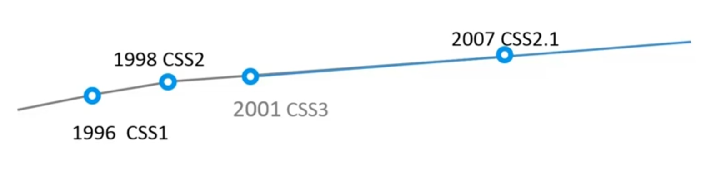
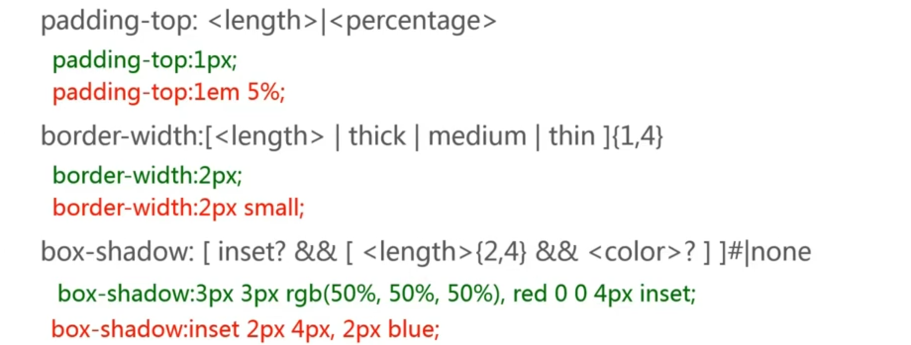
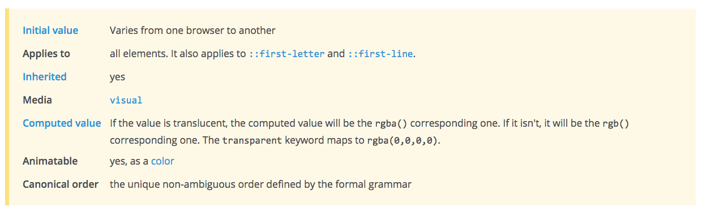

## CSS

### 简介

CSS (Cascading Stylesheet) 它用于设置页面的表现。CSS3 并不是一个完整的独立版本而是将不同的功能拆分成独立模块（例如，选择器模块，盒模型模块），这有利于不同功能的及时更新与发布也利于浏览器厂商的实习。



**CSS 引入方法**


```html

<head>
  <link rel="stylesheet" type="text/css" href="style.css">
</head>
```

```html
<head>
  <style type="text/css">
    p {
      margin: 10px;
    }
  </style>
</head>
<p style="color: red">Sample Text</p>
```

### 语法

```css
/* 选择器 */
.m-userlist {
  /* 属性声明 */
  margin: 0 0 30px;
  /* 属性名:属性值; */
}
.m-userlist .list {
  position: relative;
  height: 100px;
  overflow: hidden;
}
```

#### 浏览器私有属性

- Google Chrome, Safari (`-webkit`)
- Firefox (`-moz-`)
- IE (`-ms-`)
- Opera (`-o-`)

```css
.pic {
  -webkit-transform: rotate(-3deg);
  -moz-transform: rotate(-3deg);
  -ms-transform: rotate(-3deg);
  transform: rotate(-3deg);
}
```

NOTE: 使用 [http://pleeease.io/play/](http://pleeease.io/play/) ，CSS 预处理器（Sass，Less，Stylus）或编辑器插件可自动添加浏览器厂商的私有属性前缀。

#### 属性值语法

```css
margin: [ <length> | <percentage> | auto ]{1,4}
/* 基本元素：<length>, <percentage>, auto*/
/* 组合符号：[], | */
/* 数量符号：{1,4} */
```

##### 基本元素

**关键字**
- auto
- solid
- bold
- ...

**类型**
- 基本类型
    - `<length>`
    - `<percentage>`
    - `<color>`
    - ...
- 其他类型
    - <'padding-width'>
    - <'color-stop'>
- 符号
    - `/`
    - ','
- inherit, initial

##### 组合符号

- `<'font-size'> <'font-family'>` （` ` 两项必存，顺序毕遵）
    - 合法：`12px arial`
    - 不合法：`2em`
    - 不合法：`arial 14px`
- `<length>&&<color>` (`&&` 两项必存，顺序无碍)
    - 合法：green 2px
    - 合法：1em orange
    - 不合法：blue
- `underline || overline || line-through || blink` (`||` 至少选一，顺序无碍)
    - 合法：underline
    - 合法：overline underline
- `<color> | transparent`（`|` 只可选一，不可共存）
    - 合法：orange
    - 合法：transparent
    - 不合法：orange transparent
- `bold [thin || <length>]`（`[]` 分组之用，视为整体）
    - 合法：bold thin
    - 合法：bold 2em

##### 数量符号

- `<length>`（无则表示仅可出现一次）
    - 合法：1px
    - 合法：10em
    - 不合法：1px 2px
- `<color-stop>[, <color-stop>]+` (`+` 可出现一次或多次)
    - 合法：#fff, red
    - 合法：blue, green 50%, gray
    - 不合法：red
- `inset?&&<color>` (`?` 表示可选)
    - 合法：inset orange
    - 合法：red
- `<length>{2,4}` (`{2,4}` 可出现次数和最少最多出现次数)
    - 合法：1px 2px
    - 合法：1px 2px 3px
    - 不合法: 1px
    - 不合法：1px 2px 3px 4px 5px
- `<time>[, <time>]*`（`*` 出现 0 次或多次）
    - 合法：1s
    - 合法：1s,4ms
- `<time>#`（`#` 出现一次或者多次，用`,`分隔）
    - 合法：2s, 4s
    - 不合法：1s 2s

**CSS 规则示例**



#### @规则语法

```
@import "subs.css";
@charset "utf-8";
@media print {
  /* property: value */
}
@keyframes fadein {
  /* property: value */
}
```

- `@标示符 内容;`
- `@标示符 内容{}`

##### @规则

**常用的规则**
- `@media` （用于响应式布局）
- `@keyframes` （CSS 动画的中间步骤）
- `@font-face` （引入外部字体）

**其他规则**（不常用）
- `@import`
- `@charset`
- `@namespace`
- `@page`
- `@supports`
- `@document`

### 选择器

选择器可被看做表达式，通过它可以选择相应的元素并应用不同的样式。

- 简单选择器
- 元素选择器
- 组合选择器

#### 简单选择器

简单选择器可组合使用。

##### 标签选择器

```html
<div>
  <p>Sample Paragraph</p>
  <p>Sample Paragraph</p>
  <p>Sample Paragraph</p>
</div>

<style type="text/css">
  p {
    color: blue;
  }
</style>
```

##### 类选择器

`.className` 以 `.` 开头，名称可包含字母，数字，`-`，`_`，但必须以字母开头。它区分大小写并可出现多次。

###### class选择比较严格 如果要选择 class="sports1 sports2", 使用.sports1是不行的，这样只能选择出z只含sports的类，要想选择本来的，必须使用sports1 sports2
同时，也可以但是可以使用[class~=sports1]


```html
<div>
  <p>Sample Paragraph</p>
  <p class="special bold">Sample Paragraph</p>
  <p>Sample Paragraph</p>
</div>

<style type="text/css">
  p {
    color: blue
  }
  .special {
    color: orange;
  }
  .bold {
    font-weight: bold;
  }
</style>
```

##### id 选择器

`#idName` 以 `#` 开头且只可出现**一次**，其命名要求于 `.className` 相同。

```html
<div>
  <p id="special">Sample Paragraph</p>
</div>

<style type="text/css">
  #special {
    color: red;
  }
</style>
```

##### 通配符选择器

```html
<div>
  <p>Sample Paragraph</p>
  <p>Sample Paragraph</p>
</div>

<style type="text/css">
  * {
    color: blue;
  }
</style>
```

##### 属性选择器

`[attr]` 或 `[attr=val]` 来选择相应的元素。`#nav{...}` 既等同于 `[id=nav]{...}`。

`[attr~=val]` 可选用与选择包含 `val` 属性值的元素，像`class="title sports"` 与 `class="sports"`。`.sports{...}` 既等同于 `[class~=sports]{...}`

`[attr|=val]` 可以选择`val`开头及开头紧接`-`的属性值。

`[attr^=val]` 可选择以`val`开头的属性值对应的元素，如果值为符号或空格则需要使用引号 `""`。

`[attr$=val]` 可选择以`val`结尾的属性值对应的元素。比如[href$=pdf]

`[attr*=val]` 可选择以包含`val`属性值对应的元素。

```html
<div>
  <form action="">
    <input type="text" value="Xinyang" disabled>
    <input type="password" placeholder="Password">
    <input type="button" value="Button">
  </form>
</div>
<style type="text/css">
  [disabled] {
    background-color: orange;
  }
  [type=button] {
    color: blue;
  }
</style>
```

##### 伪类选择器

**常用伪类选择器**：

- `:link` 比如a:link
- `:visited`
- `:hover` 比如 a:hover
- `:active` 用户鼠标点击上的标识
- `:enabled`
- `:disabled`
- `:checked`
- `:first-child`
- `:last-child` 比如 li:last-child{color:red}
- `:nth-child(even)` 可为 `odd` `even` 或数字 比如li:nth-child(3n+1){color:red}  n从0开始算
- `:nth-last-child(n)` `n`从 0 开始计算 算倒数的第几个
- `:only-child` 仅选择只有一个子元素的项 比如ul:only-child
- `:only-of-type` span:only-of-type{color:red}指的是没有兄弟姐妹的 span
- `:first-of-type` 选中第一个这种类型的元素
- `:last-of-type` 选中最后一个这种类型的元素
- `:nth-of-type(even)` 倒数偶数项类型的元素
- `:nth-last-of-type(2n)`

**不常用伪类选择器**：

- `:empty` 选中页面中无子元素的标签 如`<p></p>`
- `:root` 选择 HTML 根标签
- `:not()` 参数为一般选择器
- `:target` 被锚点选中的目标元素
- `:lang()` 选中语言值为某类特殊值的元素

NOTE：请在使用时查找文档

```html
<div>
  <a href="http://sample-site.com" title="Sample Site">Sample Site</a>
</div>
<style type="text/css">
  /* 伪类属性定义有顺序要求！ */
  a:link {
    color: gray;
  }
  a:visited {
    color:red;
  }
  a:hover {
    color: green;
    /* 鼠标悬停 */
  }
  a:active {
    color: orange;
    /* 鼠标点击 */
  }
</style>
```

#### 其他选择器

##### 伪元素选择器

注意与伪类选择器的区分。

- `::first-letter` 第一个字母
- `::first-line` 第一行
- `::before{content: "before"}` 需与 `content` 一同使用 在某个元素前插入content内容
- `::after{content: "after"}` 需与 `content` 一同使用
- `::selection` 被用户选中的内容（鼠标选择高亮属性）

##### 组合选择器

class=main中

- 后代选择器 `.main h2 {...}`，使用` `表示，只要是后代就选择
- 子选择器 `.main>h2 {...}`，使用`>`表示，只有直系后代
- 兄弟选择器 `h2+p {...}`，使用`+`表示 h2后边的第一个p
- `h2~p {...}`，使用`~`表示（此标签无需紧邻），h2后边的所有p

##### 选择器分组

```html
<style type="text/css">
/* 下面两组样式声明效果一致 */
h1 {color: red;}
h2 {color: red;}
h3 {color: red;}

h1, h2, h3 {color: red;}
</style>
```

#### 继承、优先、层级

##### 继承

子元素继承父元素的样式，但并不是所有属性都是默认继承的。通过文档中的 `inherited: yes` 来判断属性是否可以自动继承。



自动继承属性：

- color
- font
- text-align
- list-style
- ...

非继承属性：

- background
- border
- position
- ...

##### 选择器的优先级

CSS Specificity Calculator 可以在[这里](http://specificity.keegan.st/)找到。更多关于 CSS 优先级别的信息可以在[这里](https://css-tricks.com/specifics-on-css-specificity/)找到（英文）。

计算方法：

- a = 行内样式，在html里边一行中的style
- b = id 选择器的数量
- c = 类、伪类的属性选择器的数量
- d = 标签选择器和伪元素选择器的数量

NOTE：从上到下优先级一次降低，且优先级高的样式会将优先级低的样式覆盖。大致公式（并不准确）如下。

```
value = a * 1000 + b * 100 + c * 10 + d
```


优先级一样的话，后面的会覆盖前面d的

###### 改变优先级

- 改变样式声明先后顺序
- 提升选择器优先级，比如加一点标签什么的
- `!important`（谨慎使用）

##### 层叠

层叠为相同属性根据优先级覆盖，如优先级相同则后面会覆盖前面的属性，而不同属性则会合并。

### 文本

#### 字体

##### 改变字号

`font-size: <absolute-size> | <relative-size> | <length> | <percentage> | inherit`

- `<absolute-size>` 有 small large medium
- `<relative-size>` 有 smaller larger

```css
div{
  font-size 12px
}
p#sample0{
  font-size 16px
}
p#sample1{
  font-size 2em
}
p#sample2{
  font-size 200%
}
```

NOTE：以上两值在开发中并不常用。`2em` 与 `200%` 都为*父元素默认大小的两倍*（参照物为父元素的字体大小 `12px`）。

##### 改变字体

`font-family: [ <family-name> | <generic-family> ]# `

`<generic-family>` 可选选项，但具体使用字体由浏览器决定
- serif
- sans-serif 微软雅黑
- cursive
- fantasy
- monospace

*设置多个字体*
font-family: arial, Verdana, sans-serif;
NOTE：优先使用靠前的字体

##### 加粗字体

`font-weight: normal | bold | bolder | lighter | 100 | 200 | 300 | 400 | 500 | 600 | 700 | 800 | 900`
font-weight: normal; 就是平常的字体，可写可不写
font-weight: bold; 字体加粗


##### 倾斜字体

`font-style: normal | italic | oblique | inherit`

`italic` 使用字体中的斜体，而 `oblique` 在没有斜体字体时强制倾斜字体。所以经常使用italic

##### 更改行距

`line-height: normal | <number> | <length> | <percentage>`

`normal` 值为浏览器决定，在1.1至1.2之间（通常设置值为1.14左右）


/* length 类型 */
line-height: 40px;
line-height: 3em;   /em表示当前字体的大小，如果字体为30px大，那么行高为90px

/* percentage 类型 */
line-height: 300%; /与em同理

/* number 类型 */
line-height: 3;


NOTE：当`line-height`为 `number` 类型时，子类直接继承其数值（不计算直接继承）,如果之后字体变了，那么line-height变为新值的三倍
而当为 `percentage` 类型时，子类则会先计算line-height再显示（先计算后继承），所以如果之后字体变了，还是原来的line-height。

##### font shorthand

`font: [ [ <‘font-style’> || <font-variant-css21> || <‘font-weight’> || <‘font-stretch’> ]? <‘font-size’> [ / <‘line-height’> ]? <‘font-family’> ] | caption | icon | menu | message-box | small-caption | status-bar`

通常使用 font-style font-weight font-size /line-height font-family
font-size font-family是必须

font: 30px/2 "Consolas", monospace;
font: italic bold 20px/1.5 arial, serif;
font: 20px arial, serif;

如果只有 font:100px; 那么是不起作用的，因为必填项没有写全


NOTE：当其他值为空时，均被设置为默认值。

##### 改变文字颜色

`color: <color>`

```css
element { color: red; }
element { color: #f00; }
element { color: #ff0000; }
element { color: rgb(255,0,0); }
element { color: rgb(100%, 0%, 0%); }
element { color: hsl(0, 100%, 50%); }

/* 50% translucent */
element { color: rgba(255, 0, 0, 0.5); }
element { color: hsla(0, 100%, 50%, 0.5); }

/* 全透明 */
element { color: transparent }
element { color: rgba(0, 0, 0, 0); }
```

#### 对齐方式

##### 文字居中

`text-align: start | end | left | right | center | justify | match-parent | start end`

NOTE：默认为文本左对齐。justify为两端对齐

##### 文本垂直对齐

常常会在一段文字中插入一个小表情，希望表情居中，这样就需要垂直对齐了。

- baseline是基线
- top对齐当前这一行的最高点
- text-top对齐文字最高点
- percentage参考的是line-height
- 20px 以baseline为起点 往上走20px 如果是负的，就是往下走

`vertical-align: baseline | sub | super | text-top | text-bottom | middle | top | bottom | <percentage> | <length>`

NOTE：`<percentage>`的参照物为`line-height`

##### 文本缩进

`text-indent: <length> | <percentage> && [ hanging || each-line ]`

NOTE：缩进两个字可使用 `text-indent: 2em;` 百分比的参考就是容器的宽度

#### 格式处理

##### 保留空格格式

`white-space: normal | pre | nowrap | pre-wrap | pre-line`

`pre` 行为同 `<pre>` 一致。

<table class="standard-table">
 <thead>
  <tr>
   <th>&nbsp;</th>
   <th>New lines</th>
   <th>Spaces and tabs</th>
   <th>Text wrapping</th>
  </tr>
 </thead>
 <tbody>
  <tr>
   <th><code>normal</code></th>
   <td>Collapse</td>
   <td>Collapse</td>
   <td>Wrap</td>
  </tr>
  <tr>
   <th><code>nowrap</code></th>
   <td>Collapse</td>
   <td>Collapse</td>
   <td>No wrap</td>
  </tr>
  <tr>
   <th><code>pre</code></th>
   <td>Preserve</td>
   <td>Preserve</td>
   <td>No wrap</td>
  </tr>
  <tr>
   <th><code>pre-wrap</code></th>
   <td>Preserve</td>
   <td>Preserve</td>
   <td>Wrap</td>
  </tr>
  <tr>
   <th><code>pre-line</code></th>
   <td>Preserve</td>
   <td>Collapse</td>
   <td>Wrap</td>
  </tr>
 </tbody>
</table>

wrap就是允许换行的意思

##### 文字换行

`word-wrap: normal | break-word`

NOTE：允许长单词自动换行。

`word-break: normal | break-all | keep-all`
NOTE： 使其从中断掉， 比如行最后出现一个单词，但是行不够长，多的字母就换行了

#### 文本装饰

##### 文字阴影

`text-shadow:none | <shadow-t>#` 或 `text-shadow:none | [<length>{2,3}&&<color>?]#`

```css
p {
  text-shadow: 1px 1px 1px #000,
               3px 3px 5px blue;
}
```
第三个px是阴影的模糊半径

1. value = The X-coordinate X 轴偏移像素
2. value = The Y-coordinate Y 轴偏移像素
3. value = The blur radius  阴影模糊半径
4. value = The color of the shadow 阴影颜色（默认为文字颜色）

##### 文本装饰（下划线等）

`text-decoration: <'text-decoration-line'> || <'text-decoration-style'> || <'text-decoration-color'>`

```css
h1.under {
    text-decoration: underline;
}
h1.over {
    text-decoration: overline;
}
p.line {
    text-decoration: line-through;
}
p.blink {
    text-decoration: blink;
}
a.none {
    text-decoration: none;
}
p.underover {
    text-decoration: underline overline;
}
```

#### 高级设置

##### 省略字符

`text-overflow: [ clip | ellipsis | <string> ]{1,2}`
clip是默认值，有没有无所谓

```css
/* 常用配合 */
p{
  text-overflow: ellipsis;/*可以出现 ....的效果，所以要结合overflow：hidden 与white-space */
  overflow: hidden; /* 溢出截取 */
  white-space: nowrap; /* 禁止换行 */
}
```

##### 更换鼠标形状

`cursor: [[<funciri>,]* [ auto | crosshair | default | pointer | move | e-resize | ne-resize | nw-resize | n-resize | se-resize | sw-resize | s-resize | w-resize| text | wait | help ]] | inherit`

**常用属性**

`cursor: [<uri>,]*[auto | default | none | help | pointer | zoom-in | zoom-out | move]`

- `<uri>` 图片资源地址代替鼠标默认形状
- `<default>` 默认光标
- `<none>` 隐藏光标
- `<pointer>` 手型光标
- `<zoom-in>`
- `<zoom-out>`
- `<move>`

```css
a {
  cursor: pointer;
  cursor: url(image-name.cur), pointer;
}
```

设置了pointer的话，当 uri 失效时或者则会起作用


##### 强制继承

`inherit` 会强制继承父元素的属性值。

```css
p{
  font-size: inherit;
  font-family: inherit;
  font-weight: inherit;
  word-wrap: inherit;
  work-break: inherit;
  text-showdow: inherit;
}
```

NOTE：具体在使用时可查询文档

### 盒模型

#### 属性


##### width

**内容盒子宽**

`width: <length> | <percentage> | auto | inherit`

NOTE：通常情况下百分比得参照物为元素的父元素。`max-width` 与 `min-width` 可以设置最大与最小宽度。

##### height

**内容盒子高**

`height: <length> | <percentage> | auto | inherit`

NOTE：默认情况元素的高度为内容高度。`max-height` 与 `min-height` 可以设置最大与最小高度。

##### padding


`padding: [<length> | <percentage>]{1,4} | inherit`

##### margin


`margin: [<length> | <percentage> | auto]{1,4} | inherit`

NOTE：`margin` 默认值为 `auto`

Trick：

```
/* 可用于水平居中 */
margin: 0 auto;
```

###### margin 合并


毗邻元素外间距（margin）会合并，既取相对较大的值。父元素与第一个和最后一个子元素的外间距也可合并。

##### border


```
border: [<br-width> || <br-style> || <color>] | inherit
border-width: [<length> | thin | medium | thick]{1,4} | inherit
border-style: [solid | dashed | dotted | ...]{1,4} |inherit
border-colro: [<color> | transparent]{1,4} | inherit
```

NOTE：`border-color` 默认为元素字体颜色。

##### border-radius


```
/* 水平半径/垂直半径 */
border-radius: [ <length> | <percentage> ]{1,4} [ / [ <length> | <percentage> ]{1,4} ]?
```

NOTE：四个角的分解属性由左上角顺时针附值。

##### overflow


`overflow: visible | hidden | scroll | auto`

NOTE：默认属性为 `visible`。使用 `overflow-x` 与 `overflow-y` 单独的设置水平和垂直方向的滚动条。

##### box-sizing


`box-sizing: content-box | border-box | inherit`

- `content-box` = 内容盒子宽高 + 填充（`Padding`）+ 边框宽（`border-width`）
- `border-box` = 内容盒子宽高

##### box-shadow


`box-shadown: none | [inset? && [ <offset-x> <offset-y> <blur-radius>? <spread-radius>? <color>? ] ]#`

```html
box-shadow: 4px  6px   3px  0px red;
             |    |     |    |
          水平偏移|     |    |
               垂直偏移 |    |
                    模糊半径 |
                          阴影大小
```

NOTE：水平与垂直偏移可以为负值即相反方向偏移。颜色默认为文字颜色。阴影不占据空间，仅为修饰效果。

##### outline

```
outline: [ <'outline-color'> || <'outline-style'> || <'outline-width'> ]
outline-width: <length> | thin | medium | thick | inherit
outline-style: solid | dashed | dotted | ... | inherit
outline-color: <color> | invert | inherit
/* invert 与当前颜色取反色 */
```

NOTE：`outline` 与 `border` 相似但无法分别设置四个方向的属性。`outline` 并不占据空间，而 `border` 占据空间，且显示位于 `border` 以外。

#### TRBL


TRBL (Top, Right, Bottom, Left) 即为顺时针从顶部开始。具有四个方向的属性都可以通过 `*-top` `*-right` `*-bottom` 与 `*-left` 单独对其进行设置。

#### 值缩写

下面的值缩写以 `padding` 为例。

> 对面相等，后者省略；四面相等，只设一个。

```html
/*      四面值 */
padding: 20px;
padding: 20px 20px 20px 20px;

/*      上下值 右左值 */
padding: 20px   10px;
padding: 20px 10px 20px 10px;

/*       上值 右左值 下值 */
padding: 20px 10px   30px;
padding: 20px 10px 30px 10px;
```

### 背景

#### background-color

```
background-color: <color>
background-color: #f00;
background-color: rgba(255, 0, 0, 0.5);
background-color: transparent; /* 默认值 */
```

#### background-image

```
background-image: <bg-image>[, <bg-image>]*
/* <bg-image> = <image> | none */
background-image: url("../image/pic.png");
background-image: url("../image/pic.png0"), url("../image/pic1.png");
/* 多张背景图时，先引入的图片在上一层后引入则在下一层 */
```

NOTE：当`background-color` 与 `background-image` 共存时，背景颜色永远在最底层（于背景图片之下）。

#### background-repeat

`background-repeat` 需与背景图片数量一致。

```
background-repeat: <repeat-style>[, <repeat-style]*
<repeat-style> = repeat-x | repeat-y | [repeat | space | round | no-repeat]{1,2}

/*                   X 轴     Y 轴 */
background-repeat: no-repeat repeat;
```

- `space` 平铺并在水平和垂直留有空隙，空隙的大小为图片均匀分布后完整覆盖显示区域的宽高
- `round` 不留空隙平铺且覆盖显示区域，图标会被缩放以达到覆盖效果（缩放不一定等比）

#### background-attachment

当页面内容超过显示区域时，使用 `local` 使背景图片同页面内容一同滚动。

```
background-attachment: <attachment>[, <attachment>]*
<attachment> = scroll | fixed | local
```

#### background-position

```
background-position: <position>[, <position>]*
<position> = [left|center|right|top|bottom|<percentage>|<length>]|[left|center|right|top|bottom|<percentage>|<length>] [left|center|right|top|bottom|<percentage>|<length>] | [center |[left|right][<percentage>|<length>]?]&&[center |[left|right][<percentage>|<length>]?]

/* 默认位置为 */
background-position: 0 0;

/* percentage 是容器与图片的百分比重合之处*/
background-position: 20% 50%;

/* 等同效果 */
background-position: 50% 50%;
background-position: center center;

background-position: 0 0;
background-position: left top;

background-position: 100% 100%;
background-position: right bottom;

/* 四个值时方向只为参照物 */
background-position: right 10px top 20px;
```


##### Sprite 的使用

```html
background-image: url(sprite.png)
background-repeat: no-repeat;
background-positon: 0 -100px
```

使用位置为负值将图片偏移使需要的图片位置上移并显示正确的图案。

### 布局

**Gecko Reflow Visualisation**


### 变形

### 动画

