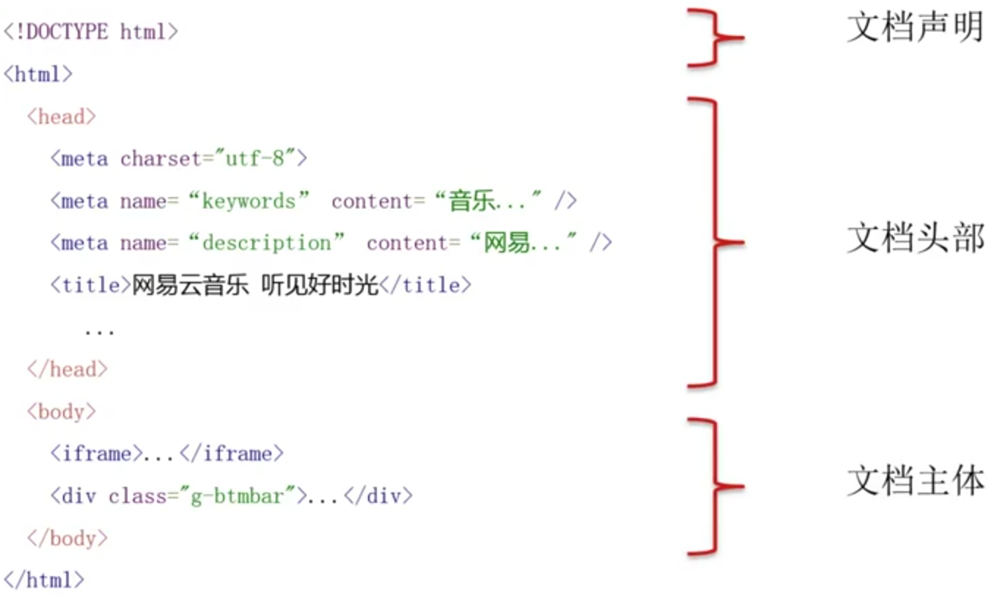
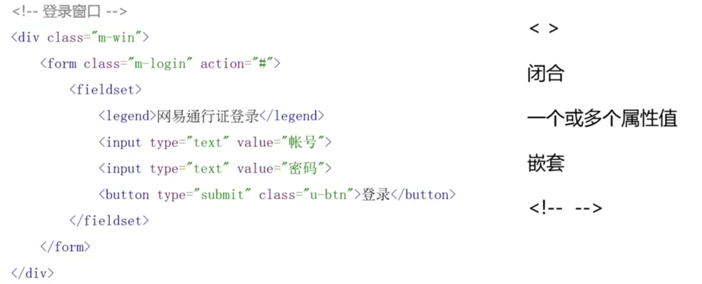

## 开发及调试工具

- 文本编辑器或 IDE (集成开发环境)
- Google Chrome, Firefox Firebug, Safari Developer Tool

NOTE: [Google Chrome DevTools Doc](https://developer.chrome.com/devtools)

####Sublime 快捷键
command/control + P 进入查找命令,此时有三种选择：

* ‘:’ 输入行数找到对应行
* ‘@’ 找到特定函数
* ‘#’ 找到对应变量与块

学会使用Emmet帮助进行前端编程


## HTML

### HTML 历史

HTML (Hyper Text Markup Language)，用于标记页面中的内容。


### HTML 简介



注意事项：

- `<!DOCTYPE html>` 必须首行定格
- `<title>` 为文档标题
- `<meta charset="utf-8">` 文档解码格式
- `<meta name="keywords" content="...">` 和 `<meta name="description" content="...">` 提供给搜索引擎使用
- `<meta name="viewport" content="width=device-width, initial-scale=1.0">` 移动端浏览器的宽高与缩放
- `<link>` 标签可以引入 favicon 和样式表 CSS 文件

### HTML 语法



**书写规范**：

- 小写标签和属性
- 属性值双引号
- 代码因嵌套缩进

#### 全局属性

- id, `<div id='unique-element'></div>`，页面中唯一
- class，`<button class='btn'>Click Me</button>`，页面中可重复出现
- style，尽量避免
- title，对于元素的描述类似于 Tool Tip 的效果。

### HTML 标签

**[HTML5 标签集合](http://www.html5star.com/manual/html5label-meaning)**


title的作用，还可以在用户鼠标移上去的时候，出现一朵云解释


页面通常结构


### 文本标签

```html
<!-- 默认超链接  -->
<a href="http://sample-link.com" title="Sample Link">Sample</a>
<!-- 当前窗口显示 -->
<a href="http://sample-link.com" title="Sample Link" target="_self">Sample</a>
<!-- 新窗口显示 -->
<a href="http://sample-link.com" title="Sample Link" target="_blacnk">Sample</a>
<!-- iframe 中打开链接 -->
<a href="http://sample-link.com" title="Sample Link" target="iframe-name">Sample</a>
<iframe name="iframe-name" frameborder="0"></iframe>

<!-- 页面中的锚点 -->
<a href="#achor">Achor Point</a>
<section id="achor">Achor Content</section>

<!-- 邮箱及电话需系统支持 -->
<a href="mailto:sample-address@me.com" title="Email">Contact Us</a>
<!-- 多个邮箱地址 -->
<a href="mailto:sample-address@me.com, sample-address0@me.com" title="Email">Contact Us</a>
<!-- 添加抄送，主题和内容 -->
<a href="mailto:sample-address@me.com?cc=admin@me.com&subject=Help&body=sample-body-text" title="Email">Contact Us</a>

<!-- 电话示例 -->
<a href="tel:99999999" title="Phone">Ring Us</a>
```

### 组合内容标签

- `<div>`
- `<p>`
- `<ol>`
- `<ul>`
- `<dl>`
- `<pre>`
- `<blockquote>`

NOTE: `<dl>` 为自定义列表，其中包含一个或多个 `<dt>` 及 一个或多个 `<dd>`,并且dt dl列表会有缩进的效果，`<pre>` 会保留换行和空格，通常与 `<code>` 一同使用。

```html
<pre>
  <code>
    int main(void) {
    printf('Hello, world!');
    return 0;
  }
</code>
</pre>
```

`<blockquote>` 拥有 `cite` 属性，它包含引用文本的出处，示例如下所示：

```html
<blockquote cite="http://example.com/facts">
  <p>Sample Quote...</p>
</blockquote>
```

### 嵌入

```html
<iframe src=""></iframe> 页面操作可以不影响到iframe的内容

<!--object embed通常用来嵌入外部资源 -->
<object type="application/x-shockwave-player">
	<param name="movie" value="book.pdf">
</object>

<!--视频 track可以引入字幕 autoplay可以使视频加载后自动播放，loop可以使其循环播放 -->
<video autoplay loop controls="controls" poster="poster.jpg">
	<source src="movie.mp4" type="video/mp4">
	<source src="movie.webm" type="video/webm">
	<source src="movie.ogg" type="video/ogg">
	<track kind="subtitles" src="video.vtt" srclang="cn" label="cn">
</video>
```
### 嵌入资源
####图标签
canvas 基于像素，性能要求比较高，实时数据展示

svg 矢量图形图像

####热点区域标签
map与area
img中套用map以及area可以实现点击某部分图片进入一个链接，另一部分进入另一个链接

```html

<map name="map">
    <area shap="rect" coords="0,0,50,50" href="" alt="">
    <area shap="circle" coords="75,75,25" href="" alt="">
</map>
```

#### 表格
学会使用*rowspan*来进行跨行显示


<table class="reference notranslate">
  <tbody><tr>
    <th style="width:22%">Value</th>
    <th>Description</th>
  </tr>
  <tr>
    <td>button</td>
    <td>Defines a clickable button (mostly used with a JavaScript to activate a script)</td>
  </tr>
  <tr>
    <td>checkbox</td>
    <td>Defines a checkbox</td>
  </tr>
  <tr>
  <td class="html5badge">color</td>
    <td>Defines a color picker</td>
  </tr>
  <tr>
  <td class="html5badge">date</td>
    <td>Defines a date control (year, month and day (no time))</td>
  </tr>
  <tr>
  <td class="html5badge">datetime</td>
    <td>The input type datetime has been removed from the HTML standard. Use datetime-local instead.</td>
    </tr>
    <tr>
    <td class="html5badge">datetime-local</td>
      <td>Defines a date and time control (year, month, day, hour, minute, second, and fraction of a second (no time zone)</td>
      </tr>
      <tr>
      <td class="html5badge">email</td>
        <td>Defines a field for an e-mail address</td>
      </tr>
      <tr>
        <td>file</td>
        <td>Defines a file-select field and a "Browse..." button (for file uploads)</td>
      </tr>
      <tr>
        <td>hidden</td>
        <td>Defines a hidden input field</td>
      </tr>
      <tr>
        <td>image</td>
        <td>Defines an image as the submit button</td>
      </tr>
      <tr>
      <td class="html5badge">month</td>
        <td>Defines a month and year control (no time zone)</td>
      </tr>
      <tr>
      <td class="html5badge">number</td>
        <td>Defines a field for entering a number</td>
      </tr>
      <tr>
        <td>password</td>
        <td>Defines a password field (characters are masked)</td>
      </tr>
      <tr>
        <td>radio</td>
        <td>Defines a radio button</td>
      </tr>
      <tr>
      <td class="html5badge">range</td>
        <td>Defines a control for entering a number whose exact value is not important (like a slider control)</td>
      </tr>
      <tr>
        <td>reset</td>
        <td>Defines a reset button (resets all form values to default values)</td>
      </tr>
      <tr>
      <td class="html5badge">search</td>
        <td>Defines a text field for entering a search string</td>
      </tr>
      <tr>
        <td>submit</td>
        <td>Defines a submit button</td>
      </tr>
      <tr>
      <td class="html5badge">tel</td>
        <td>Defines a field for entering a telephone number</td>
      </tr>
      <tr>
        <td>text</td>
        <td>Default. Defines a single-line text field (default width is 20 characters)</td>
      </tr>
      <tr>
      <td class="html5badge">time</td>
        <td>Defines a control for entering a time (no time zone)</td>
      </tr>
      <tr>
      <td class="html5badge">url</td>
        <td>Defines a field for entering a URL</td>
      </tr>
      <tr>
      <td class="html5badge">week</td>
        <td>Defines a week and year control (no time zone)</td>
      </tr>
    </tbody>
</table>


### 表格以及Input

使用*fieldset*进行分区
也有如下input type
- `textarea`
- `select` 与 `option`
现在也有新的Input type类型
比如email,url,number,tel,search,range,color,date picker(date,month,week,time)


<form action="WebCreation_submit" method="get" accept-charset="utf-8">
  <fieldset>
    <legend>title or explanatory caption</legend>
    <!-- 第一种添加标签的方法 -->
    <label><input type="text/submit/hidden/button/etc" name="" value=""></label>
    <!-- 第二种添加标签的方法 -->
    <label for="input-id">Sample Label</label>
    <input type="text" id="input-id">
  </fieldset>
  <fieldset>
    <legend>title or explanatory caption</legend>
    <!-- 只读文本框 -->
    <input type="text" readonly>
    <!-- 隐藏文本框，可提交影藏数据 -->
    <input type="text" name="hidden-info" value="hiden-info-value" hidden>
  </fieldset>
  <button type="submit">Submit</button>
  <button type="reset">Reset</button>
</form>


### 语义化

语义化（Semantic Tag）是指用合适的标签标识适当的内容，它可以起到搜索引擎优化（Search Engine Optimization），提高可访问性（例如盲人使用的屏幕阅读器），与此同时还可以提高代码的可读性。

### 实体字符

实体字符（ASCII Encoding Reference）是用来在代码中以实体代替与HTML语法相同的字符，避免浏览解析错误。它的两种表示方式，第一种为 `&` 外加实体字符名称，例如 `&nbsp;`，第二种为 `&` 加实体字符序号，例如 `&#160;`。

```html
<table>
    <caption>常用HTML字符实体（建议使用实体）：</caption>
    <thead>
        <tr>
            <th>字符</th>
            <th>名称</th>
            <th>实体名</th>
            <th>实体数</th>
        </tr>
    </thead>
    <tbody>
        <tr>
            <td>&quot;</td>
            <td>双引号</td>
            <td>&amp;quot;</td>
            <td>&amp;#34;</td>
        </tr>
        <tr>
            <td>&amp;</td>
            <td>&amp;符</td>
            <td>&amp;amp;</td>
            <td>&amp;#38;</td>
        </tr>
        <tr>
            <td>&lt;</td>
            <td>左尖括号（小于号）</td>
            <td>&amp;lt;</td>
            <td>&amp;#60;</td>
        </tr>
        <tr>
            <td>&gt;</td>
            <td>右尖括号（大于号）</td>
            <td>&amp;gt;</td>
            <td>&amp;#62;</td>
        </tr>
        <tr>
            <td>&nbsp;</td>
            <td>空格</td>
            <td>&amp;nbsp;</td>
            <td>&amp;#160;</td>
        </tr>
        <tr>
            <td>&#12288;</td>
            <td>中文全角空格</td>
            <td>&nbsp;</td>
            <td>&amp;#12288;</td>
        </tr>
    </tbody>
</table>

<table>
    <caption>常用特殊字符实体（不建议使用实体）：</caption>
    <thead>
        <tr>
            <th>字符</th>
            <th>名称</th>
            <th>实体名</th>
            <th>实体数</th>
        </tr>
    </thead>
    <tbody>
        <tr>
            <td>&yen;</td>
            <td>元</td>
            <td>&amp;yen;</td>
            <td>&amp;#165;</td>
        </tr>
        <tr>
            <td>&brvbar;</td>
            <td>断竖线</td>
            <td>&amp;brvbar;</td>
            <td>&amp;#166;</td>
        </tr>
        <tr>
            <td>&copy;</td>
            <td>版权</td>
            <td>&amp;copy;</td>
            <td>&amp;#169;</td>
        </tr>
        <tr>
            <td>&reg;</td>
            <td>注册商标R</td>
            <td>&amp;reg;</td>
            <td>&amp;#174;</td>
        </tr>
        <tr>
            <td>&trade;</td>
            <td>商标TM</td>
            <td>&amp;trade;</td>
            <td>&amp;#8482;</td>
        </tr>
        <tr>
            <td>&middot;</td>
            <td>间隔符</td>
            <td>&amp;middot;</td>
            <td>&amp;#183;</td>
        </tr>
        <tr>
            <td>&laquo;</td>
            <td>左双尖括号</td>
            <td>&amp;laquo;</td>
            <td>&amp;#171;</td>
        </tr>
        <tr>
            <td>&raquo;</td>
            <td>右双尖括号</td>
            <td>&amp;raquo;</td>
            <td>&amp;#187;</td>
        </tr>
        <tr>
            <td>&deg;</td>
            <td>度</td>
            <td>&amp;deg;</td>
            <td>&amp;#176;</td>
        </tr>
        <tr>
            <td>&times;</td>
            <td>乘</td>
            <td>&amp;times;</td>
            <td>&amp;#215;</td>
        </tr>
        <tr>
            <td>&divide;</td>
            <td>除</td>
            <td>&amp;divide;</td>
            <td>&amp;#247;</td>
        </tr>
        <tr>
            <td>&permil;</td>
            <td>千分比</td>
            <td>&amp;permil;</td>
            <td>&amp;#8240;</td>
        </tr>
    </tbody>
</table>
```
NOTE：具体所需可在使用时查询，无需记忆。

###浏览器兼容
主流浏览器都兼容HTML5的新标签，对于 IE8 及以下版本不认识 HTML5的新元素，可以使用 JavaScript 创建一个没用的元素来解决，例如：

```javascript
<script>document.createElement("header");</script>
```
也可以使用shiv来解决兼容性问题，详情可参考[HTML5 Shiv](https://github.com/afarkas/html5shiv)
